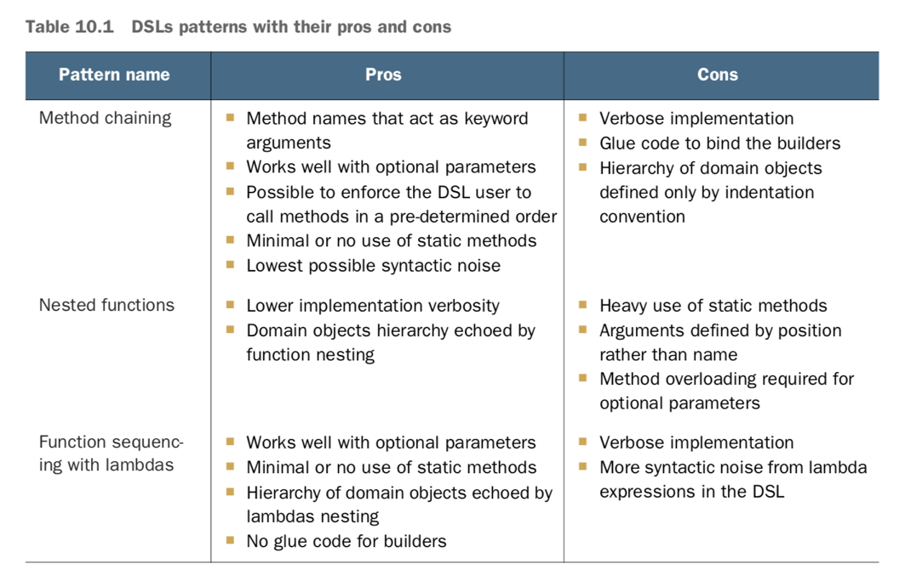

# Chapter 7: Parallel data processing and performance

For instance, before Java 7, processing a collection of data in parallel was extremely cumbersome. 
First, you needed to explicitly split the data structure containing your data into subparts. 
Second, you needed to assign each of these subparts to a different thread. 
Third, you needed to synchronize them opportunely to avoid unwanted race conditions, wait for the completion of all threads, and 
finally, combine the partial results.
    
    Java 7 introduced a framework called fork/join to perform these operations more consistently and
    in a less error-prone way.

## Parallel streams
    
A parallel stream is a stream that splits its elements into multiple chunks, processing each chunk with a different thread. 
Thus, you can automatically partition the workload of a given operation on all the cores of your multicore processor and keep all of them equally busy. 
    
    
Let’s suppose you need to write a method accepting a number n as argument and returning the sum of the numbers from one to n. 
    
A straightforward (perhaps naïve) approach is to generate an infinite stream of numbers, limiting it to the passed numbers, 
and then reduce the resulting stream with a BinaryOperator that sums two numbers, as follows:
    
    public long sequentialSum(long n) {
        return Stream.iterate(1L, i -> i + 1)
                     .limit(n)
                     .reduce(0L, Long::sum);
    }

This operation seems to be a good candidate to use parallelization, especially for large values of n. 
But where do you start? 
Do you synchronize on the result variable? 
How many threads do you use? Who does the generation of numbers? 
Who adds them up?
    
### Turning a sequential stream into a parallel one

Call the method parallel on the sequential stream:    
    
    public long parallelSum(long n) {
        return Stream.iterate(1L, i -> i + 1)
                     .limit(n)
                     .parallel()
                     .reduce(0L, Long::sum);
    }

Parallel streams internally use the default ForkJoinPool, which by default has as many threads as you have processors, 
as returned by Runtime.getRuntime().availableProcessors().
    
You can expect a significant performance improvement in its parallel version when running it on a multicore processor. 
    
    
### Measuring stream performance

Java Microbenchmark Harness (JMH): This is a tool- kit that helps to create, in a simple, annotation-based way, reliable microbenchmarks for Java programs 
and for any other language targeting the Java Virtual Machine (JVM). 
    
    
Add a couple of dependencies to your pom.xml file
    
    <dependency>
      <groupId>org.openjdk.jmh</groupId>
      <artifactId>jmh-core</artifactId>
      <version>1.17.4</version>
    </dependency>
    <dependency>
      <groupId>org.openjdk.jmh</groupId>
      <artifactId>jmh-generator-annprocess</artifactId>
      <version>1.17.4</version>
    </dependency>
    
    <build>
        <plugins>
        <plugin>
          <groupId>org.apache.maven.plugins</groupId>
          <artifactId>maven-shade-plugin</artifactId>
          <executions>
            <execution>
              <phase>package</phase>
              <goals><goal>shade</goal></goals>
              <configuration>
                <finalName>benchmarks</finalName>
                <transformers>
                  <transformer implementation="org.apache.maven.plugins.shade.
                                         resource.ManifestResourceTransformer">
                    <mainClass>org.openjdk.jmh.Main</mainClass>
                  </transformer>
                </transformers>
              </configuration>
            </execution>
          </executions>
        </plugin>
        </plugins>
    </build>  
    
    
    
    @BenchmarkMode(Mode.AverageTime)
    @OutputTimeUnit(TimeUnit.MILLISECONDS)
    @Fork(2, jvmArgs={"-Xms4G", "-Xmx4G"})
    public class ParallelStreamBenchmark {
        private static final long N= 10_000_000L;
        
        @Benchmark
        public long sequentialSum() {
          return Stream.iterate(1L, i -> i + 1).limit(N)
                     .reduce( 0L, Long::sum);
        }

        @TearDown(Level.Invocation)
        public void tearDown() {
            System.gc();
        }
    }
    
When you compile this class, the Maven plugin configured before generates a second JAR file named benchmarks.jar that you can run as follows:
    
    java -jar ./target/benchmarks.jar ParallelStreamBenchmark

1. Use an oversized heap to avoid any influence of the garbage collector as much as possible.
2. We tried to enforce the garbage collector to run after each iteration of our benchmark.

Executing it on a computer equipped with an Intel i7-4600U 2.1 GHz quad-core, it prints the following result:

    Benchmark                                Mode  Cnt    Score    Error  Units
    ParallelStreamBenchmark.sequentialSum    avgt   40  121.843 ±  3.062  ms/op

    @Benchmark
    public long iterativeSum() {
        long result = 0;
        for (long i = 1L; i <= N; i++) {
    result += i; }
        return result;
    }

    Benchmark                                Mode  Cnt    Score    Error  Units
    ParallelStreamBenchmark.iterativeSum     avgt   40    3.278 ±  0.192  ms/op

    Benchmark                                Mode  Cnt    Score    Error  Units
    ParallelStreamBenchmark.parallelSum      avgt   40  604.059 ± 55.288  ms/op
    
The parallel version of the summing method isn’t taking any advantage of our quad-core CPU and is around five times slower than the sequential one. 

Two issues are mixed together:
    1.a. iterate generates boxed objects, which have to be unboxed to numbers before they can be added.
    1.b. iterate is difficult to divide into independent chunks to execute in parallel.
    2.   iterate operation is hard to split into chunks that can be executed independently, because the input of one function application always depends on 
         the result of the previous application.

The whole list of numbers isn’t available at the beginning of the reduction process, making it impossible to efficiently partition the stream in chunks to be 
processed in parallel. By flagging the stream as parallel, you’re adding the overhead of allocating each sum operation on a different thread to the sequential processing.    
  

So how can you use your multicore processors and use the stream to perform a parallel sum in an effective way?    

   1.a LongStream.rangeClosed works on primitive long numbers directly so there’s no boxing and unboxing overhead.
   1.b LongStream.rangeClosed produces ranges of numbers, which can be easily split into independent chunks.
   
       @Benchmark
       public long rangedSum() {
           return LongStream.rangeClosed(1, N)
                            .reduce(0L, Long::sum);
       }
   
   Benchmark                                Mode  Cnt    Score    Error  Units
   ParallelStreamBenchmark.rangedSum        avgt   40    5.315 ±  0.285  ms/op

       @Benchmark
       public long parallelRangedSum() {
           return LongStream.rangeClosed(1, N)
                            .parallel()
                            .reduce(0L, Long::sum);
       }
       
   Benchmark                                  Mode  Cnt  Score    Error  Units
   ParallelStreamBenchmark.parallelRangedSum  avgt   40  2.677 ±  0.214  ms/op

Finally, we got a parallel reduction that’s faster than its sequential counterpart.

Note that this latest version is also around 20% faster than the original iterative one, demonstrating that, when used correctly.

Moving data between multiple cores is also more expensive than you might expect, so it’s important that work to be done in parallel on another core takes 
longer than the time required to transfer the data from one core to another.    

### Using parallel streams correctly

The main cause of errors generated by misuse of parallel streams is the use of algorithms that mutate some shared state.

    public long sideEffectSum(long n) {
        Accumulator accumulator = new Accumulator();
        LongStream.rangeClosed(1, n).forEach(accumulator::add);
        return accumulator.total;
    }
    
    public class Accumulator {
        public long total = 0;
        public void add(long value) { total += value; }
    }

Unfortunately, it’s irretrievably broken because it’s fundamentally sequential. You have a data race on every access of total. 
And if you try to fix that with synchronization, you’ll lose all your parallelism.

    public long sideEffectParallelSum(long n) {
        Accumulator accumulator = new Accumulator();
        LongStream.rangeClosed(1, n).parallel().forEach(accumulator::add);
        return accumulator.total;
    }

### Using parallel streams effectively

Its difficult to advice whether it makes sense to use a parallel stream in a certain situation:

1. Automatic boxing and unboxing operations can dramatically hurt performance. Java 8 includes primitive streams (IntStream, LongStream, and DoubleStream) 
   to avoid such operations, so use them when possible.
2. In particular, operations such as limit and findFirst that rely on the order of the elements are expensive in a parallel stream. 
   For example, findAny will perform better than findFirst because it isn’t constrained to operate in the encounter order. 
   You can always turn an ordered stream into an unordered stream by invoking the method unordered on it. 
3. For a small amount of data, choosing a parallel stream is almost never a winning decision.
4. Take into account how well the data structure underlying the stream decomposes. For instance, an ArrayList can be split much more efficiently than a LinkedList, 
   because the first can be evenly divided without traversing it, as it’s necessary to do with the second. The primitive streams created with the range factory method 
   can be decomposed quickly.
5. A SIZED stream can be divided into two equal parts, and then each part can be processed in parallel more effectively, but a filter operation can throw away an 
   unpredictable number of elements, making the size of the stream itself unknown.
6. Whether a terminal operation has a cheap or expensive merge step. If this is expensive, then the cost caused by the combination of the partial results generated
   by each substream can outweigh the performance benefits of a parallel stream. (for example, the combiner method in a Collector)
   
  
## The fork/join framework

Designed to recursively split a parallelizable task into smaller tasks and then combine the results of each subtask to produce the overall result.  

### Working with RecursiveTask

Create a subclass of RecursiveTask<R>, where R is the type of the result produced by the parallelized task or of RecursiveAction if the task returns no result.
    
    protected abstract R compute();

Responsibility of this method.
1.  Logic of splitting the task at hand into subtasks.
2.  The algorithm to produce the result of a single subtask when it’s no longer possible or convenient to further divide it.

    if (task is small enough or no longer divisible) {
        compute task sequentially
    } else {
        split task in two subtasks
        call this method recursively possibly further splitting each subtask
        wait for the completion of all subtasks
        combine the results of each subtask
    }
    
 
### Best practices for using the fork/join framework

1. Invoking the join method on a task blocks the caller until the result produced by that task is ready. It’s necessary to call it after the computation of both subtasks has been started.
2. The invoke method of a ForkJoinPool shouldn’t be used from within a RecursiveTask. Instead, you should always call the methods compute or fork directly; only 
   sequential code should use invoke to begin parallel computation.
3. Calling the fork method on a subtask is the way to schedule it on the Fork- JoinPool. Doing this allows you to reuse the same thread for one of the two subtasks and avoid the overhead 
   caused by the unnecessary allocation of a further task on the pool.

### Work stealing

This means that the tasks are more or less evenly divided on all the threads in the ForkJoinPool. Each of these threads holds a doubly linked queue of the tasks 
assigned to it, and as soon as it completes a task it pulls another one from the head of the queue and starts executing it.

One thread might complete all the tasks assigned to it much faster than the others, which means its queue will become empty while the other threads are still pretty busy.
In this case, instead of becoming idle, the thread randomly chooses a queue of a different thread and “steals” a task, taking it from the tail of the queue.

## Spliterator

Spliterators are used to traverse the elements of a source, but they’re also designed to do this in parallel.

    The Spliterator interface
    
    public interface Spliterator<T> {
                boolean tryAdvance(Consumer<? super T> action);
                Spliterator<T> trySplit();
                long estimateSize();
                int characteristics();
    }
    
    T is the type of the elements traversed by the Spliterator.
    

tryAdvance : used to sequentially consume the elements of the Spliterator one by one, returning true if there are still other elements to be traversed.
trySplit: used to partition off some of its elements to a second Spliterator (the one returned by the method), allowing the two to be processed in parallel.
estimateSize: provide an estimation of the number of the elements remaining to be traversed.     

### The splitting process            

First step, trySplit is invoked on the first Spliterator and generates a second one.
Step two, it’s called again on these two Spliterators, which results in a total of four. 
Step 3, The framework keeps invoking the method trySplit on a Spliterator until it returns null to signal that the data structure that it’s processing is no longer divisible.
Step 4, This recursive splitting process terminates when all Spliterators have returned null to a trySplit invocation.

# Chapter 8: Collection API enhancements

## Collection factories

A more convenient way to write this code is to use the Arrays.asList() factory method:

    List<String> friends
       = Arrays.asList("Raphael", "Olivia", "Thibaut");

Attempting to add elements, for example, results in an Unsupported- ModificationException, but updating by using the method set is allowed:

    List<String> friends = Arrays.asList("Raphael", "Olivia");
    friends.set(0, "Richard");
    
    friends.add("Thibaut");
    throws an UnsupportedOperationException 
    
This behavior seems slightly surprising because the underlying list is backed by a mutable array of fixed size.

How about a Set? Unfortunately, there’s no Arrays.asSet() factory method, so you need another trick.

    Set<String> friends "
       = new HashSet<>(Arrays.asList("Raphael", "Olivia", Thibaut"));

Alternatively you could use the Streams API:

    Set<String> friends
       = Stream.of("Raphael", "Olivia", "Thibaut")
               .collect(Collectors.toSet());

Both solutions, however, are far from elegant and involve unnecessary object allocations behind the scenes. Also note that you get a mutable Set as a result.

### List factory

    List<String> friends = List.of("Raphael", "Olivia", "Thibaut");
    friends.add("Chih-Chun");
    
1. Running this code results in a java.lang.UnsupportedOperationException.
2. List that’s produced is immutable.    

### Set factory

If you try to create a Set by providing a duplicated element, you receive an IllegalArgumentException.

    Set<String> friends = Set.of("Raphael", "Olivia", "Olivia");

### Map factories

You have two ways to initialize an immutable map in Java 9.

    Map<String, Integer> ageOfFriends
       = Map.of("Raphael", 30, "Olivia", 25, "Thibaut", 26);
    System.out.println(ageOfFriends);
    
This method is convenient if you want to create a small map of up to ten keys and values.     

To go beyond this,

    import static java.util.Map.entry;
    Map<String, Integer> ageOfFriends
           = Map.ofEntries(entry("Raphael", 30),
                           entry("Olivia", 25),
                           entry("Thibaut", 26));
    System.out.println(ageOfFriends);

### Working with List and Set

removeIf(): removes element matching a predicate. It’s available on all classes that implement List or Set.   

    transactions.removeIf(transaction ->
                 Character.isDigit(transaction.getReferenceCode().charAt(0)));
 
replaceAll(): is available on List and replaces elements using a (UnaryOperator) function.

    referenceCodes.replaceAll(code -> Character.toUpperCase(code.charAt(0)) +
                 code.substring(1));
                 
sort(): is also available on the List interface and sorts the list itself.

## Working with Map

### forEach

Since Java 8, the Map interface has supported the forEach method, which accepts a BiConsumer, taking the key and value as arguments. 

    ageOfFriends.forEach((friend, age) -> System.out.println(friend + " is " +
                 age + " years old"));
                 
* A concern related to iterating over date is sorting it.

### Sorting

Two new utilities let you sort the entries of a map by values or keys:
     Entry.comparingByValue 
     Entry.comparingByKey                 
    
    
    favouriteMovies
      .entrySet()
      .stream()
      .sorted(Entry.comparingByKey())
      .forEachOrdered(System.out::println);
      
### HashMap and Performance (New implementation of HashMap from Java8)

1. The internal structure of a HashMap was updated in Java 8 to improve performance.
2. Entries of a map typically are stored in buckets accessed by the generated hashcode of the key. But if many keys return the same hashcode, performance 
   deteriorates because buckets are implemented as LinkedLists with O(n) retrieval.          
3. But now, when the buckets become too big, they’re replaced dynamically with sorted trees, which have O(log(n)) retrieval and improve the lookup of colliding elements.    
4. Use of sorted trees is possible only when the keys are Comparable (such as String or Number classes).

### getOrDefault

    Map<String, String> favouriteMovies
                   = Map.ofEntries(entry("Raphael", "Star Wars"),
                  entry("Olivia", "James Bond"));
                  
                  
    System.out.println(favouriteMovies.getOrDefault("Olivia", "Matrix")); #O/P: Olivia
    System.out.println(favouriteMovies.getOrDefault("Thibaut", "Matrix")); #O/P: Matrix
    
### Compute patterns

Perform an operation conditionally and store its result, depending on whether a key is present or absent in a Map.              

Three new operations can help:

computeIfAbsent — If there’s no specified value for the given key (it’s absent or its value is null), calculate a new value by using the key and add it to the Map.
computeIfPresent — If the specified key is present, calculate a new value for it and add it to the Map.   
compute — This operation calculates a new value for a given key and stores it in the Map.

    Map<String, byte[]> dataToHash = new HashMap<>();
    MessageDigest messageDigest = MessageDigest.getInstance("SHA-256");
            
    lines.forEach(line -> dataToHash.computeIfAbsent(line,this::calculateDigest));       
    
    private byte[] calculateDigest(String key) {
       return messageDigest.digest(key.getBytes(StandardCharsets.UTF_8));
    } 
    
### Remove patterns

    String key = "Raphael";
    String value = "Jack Reacher 2";
    if (favouriteMovies.containsKey(key) &&
         Objects.equals(favouriteMovies.get(key), value)) {
       favouriteMovies.remove(key);
       return true;
    } else {
       return false;
    }
    
    OR
    
    favouriteMovies.remove(key, value);
    
### Replacement patterns

    Map<String, String> favouriteMovies = new HashMap<>(); 
    favouriteMovies.put("Raphael", "Star Wars");
    favouriteMovies.put("Olivia", "james bond"); 
    favouriteMovies.replaceAll((friend, movie) -> movie.toUpperCase()); 
    
    System.out.println(favouriteMovies);  <-  {Olivia=JAMES BOND, Raphael=STAR WARS}
    
    
### Merge

    1. Map<String, String> family = Map.ofEntries(entry("Teo", "Star Wars"), entry("Cristina", "James Bond"));
    Map<String, String> friends = Map.ofEntries(entry("Raphael", "Star Wars"));    
    
    Map<String, String> everyone = new HashMap<>(family);
    everyone.putAll(friends);
    
    System.out.println(everyone);  <-  {Cristina=James Bond, Raphael= Star Wars, Teo=Star Wars}
    

    2. Map<String, String> everyone = new HashMap<>(family);
    friends.forEach((k, v) -> everyone.merge(k, v, (movie1, movie2) -> movie1 + " & " + movie2));
    
    System.out.println(everyone);  <- Outputs {Raphael=Star Wars, Cristina= James Bond & Matrix, Teo=Star Wars}
    
    
    3. Map<String, Long> moviesToCount = new HashMap<>();
       String movieName = "JamesBond";
       long count = moviesToCount.get(movieName);
     
       if(count == null) {
          moviesToCount.put(movieName, 1);
       }
       else {
          moviesToCount.put(moviename, count + 1);
       }
       
       This code can be rewritten as
       
       moviesToCount.merge(movieName, 1L, (key, count) -> count + 1L);
       
## Improved ConcurrentHashMap

1. ConcurrentHashMap allows concurrent add and update operations that lock only certain parts of the internal data structure.
2. Thus, read and write operations have improved performance compared with the synchro- nized Hashtable alternative.
    
ConcurrentHashMap supports three new kinds of operations:
    
     forEach—Performs a given action for each (key, value)
     reduce—Combines all (key, value) given a reduction function into a result
     search—Applies a function on each (key, value) until the function produces a non-null result       

Each kind of operation supports four forms.
    
     Operates with keys and values (forEach,reduce,search)
     Operates with keys (forEachKey,reduceKeys,searchKeys)
     Operates with values (forEachValue,reduceValues,searchValues)
     Operates with Map.Entry objects (forEachEntry, reduceEntries, searchEntries)
    
The reduceValues method to find the maximum value in the map:
    
    ConcurrentHashMap<String, Long> map = new ConcurrentHashMap<>();
    long parallelismThreshold = 1;
    Optional<Integer> maxValue = Optional.ofNullable(map.reduceValues(parallelismThreshold, Long::max));

# Chapter 9: Refactoring, testing, and debugging

## Refactoring for improved readability and flexibility

Lambda expressions let you represent a piece of behavior in a more compact form compared with using anonymous classes. 
Execute multiple behaviors passed as arguments to cope with requirement changes.

### From anonymous classes to lambda expressions

Instead of: 
    
    Runnable r1 = new Runnable() {
        public void run(){
            System.out.println("Hello");
        }
    }

Use:

    Runnable r2 = () -> System.out.println("Hello");
    

### From lambda expressions to method references

Instead of: 

    Map<CaloricLevel, List<Dish>> dishesByCaloricLevel =
              menu.stream()
                  .collect(
                      groupingBy(dish -> {
                        if (dish.getCalories() <= 400) return CaloricLevel.DIET;
                        else if (dish.getCalories() <= 700) return CaloricLevel.NORMAL;
                        else return CaloricLevel.FAT;
    }));

Use:         

    Map<CaloricLevel, List<Dish>> dishesByCaloricLevel =
                menu.stream().collect(groupingBy(Dish::getCaloricLevel));
                
    
    
    public class Dish{
                ...
                public CaloricLevel getCaloricLevel() {
                    if (this.getCalories() <= 400) return CaloricLevel.DIET;
                    else if (this.getCalories() <= 700) return CaloricLevel.NORMAL;
                    else return CaloricLevel.FAT;
                }
    }            
    
Instead of: 

    inventory.sort((Apple a1, Apple a2) -> a1.getWeight().compareTo(a2.getWeight()));    
    
Use:

    inventory.sort(comparing(Apple::getWeight));

Instead of:

    int totalCalories = menu.stream().map(Dish::getCalories).reduce(0, (c1, c2) -> c1 + c2);    
    
Use:

    int totalCalories = menu.stream().collect(summingInt(Dish::getCalories));
    
### From imperative data processing to Streams

Instead of:

    List<String> dishNames = new ArrayList<>();
    for(Dish dish: menu) {
        if(dish.getCalories() > 300) {
            dishNames.add(dish.getName());
        }
    }    
    
Use:

    menu.parallelStream()
        .filter(d -> d.getCalories() > 300)
        .map(Dish::getName)
        .collect(toList());    
        
       
Unfortunately, converting imperative code to the Streams API can be a difficult task, because you need to think about control flow statements such as 
break, continue, and return and then infer the right stream operations to use.        

The good news is that some tools (e.g., Lambda Ficator, https://ieeexplore.ieee.org/document/6606699) can help you with this task as well.

### Improving code flexibility

#### Conditional deferred execution

Consider the following code, which uses the built-in Java Logger class:

    if (logger.isLoggable(Log.FINER)) {
                logger.finer("Problem: " + generateDiagnostic());
    }

What’s wrong with it ?

1. The state of the logger (what level it supports) is exposed in the client code through the method isLoggable.
2. Why should you have to query the state of the logger object every time before you log a message? It clutters your code.

Solution.

A better alternative is to use the log method, which checks internally to see whether the logger object is set to the right level before logging the message:

    logger.log(Level.FINER, () -> "Problem: " + generateDiagnostic());
    
Consider introducing a new method that calls that method, passed as a lambda or method reference, only after internally checking the state of the object.     

## Refactoring object-oriented design patterns with lambdas

### Strategy

If you think about it, lambda expressions encapsulate a piece of code (or strategy), which is what the strategy design pattern was created for, so we recommend 
that you use lambda expressions instead for similar problems.

    Validator numericValidator =  new Validator((String s) -> s.matches("[a-z]+"));     <-      Passing a lambda directly
    boolean b1 = numericValidator.validate("aaaa");

    Validator lowerCaseValidator = new Validator((String s) -> s.matches("\\d+"));      <-      Passing a lambda directly
    boolean b2 = lowerCaseValidator.validate("bbbb");

### Template method

The template method design pattern is a common solution when you need to repre- sent the outline of an algorithm and have the additional flexibility to change 
certain parts of it.

Instead of:

    abstract class OnlineBanking {
       public void processCustomer(int id){
            Customer c = Database.getCustomerWithId(id);
            makeCustomerHappy(c);
       }
       abstract void makeCustomerHappy(Customer c);
    }
    
    
Use:

    public void processCustomer(int id, Consumer<Customer> makeCustomerHappy) {
                Customer c = Database.getCustomerWithId(id);
                makeCustomerHappy.accept(c);
    }

    new OnlineBankingLambda().processCustomer(1337, (Customer c) ->
                 System.out.println("Hello " + c.getName());

### Observer

The observer design pattern is a common solution when an object (called the subject) needs to automatically notify a list of other objects (called observers) 
when some event happens (such as a state change)

    f.registerObserver((String tweet) -> {
            if(tweet != null && tweet.contains("money")){
                System.out.println("Breaking news in NY! " + tweet);
            }
    });
    f.registerObserver((String tweet) -> {
            if(tweet != null && tweet.contains("queen")){
                System.out.println("Yet more news from London... " + tweet);
    }
    });
    
    
### Chain of responsibility

UnaryOperator<String> headerProcessing = (String text) -> "From Raoul, Mario and Alan: " + text;
UnaryOperator<String> spellCheckerProcessing = (String text) -> text.replaceAll("labda", "lambda");
Function<String, String> pipeline =  headerProcessing.andThen(spellCheckerProcessing);
String result = pipeline.apply("Aren't labdas really sexy?!!");    

### Factory

    final static Map<String, Supplier<Product>> map = new HashMap<>();
    static {
        map.put("loan", Loan::new);
        map.put("stock", Stock::new);
        map.put("bond", Bond::new);
    }

    public static Product createProduct(String name){
        Supplier<Product> p = map.get(name);
        if(p != null) return p.get();
        throw new IllegalArgumentException("No such product " + name);
    }

# Chapter 10: Domain-specific languages using lambdas

 For a DSL to interact with the database instead of writing pure Java code, technically, this type of DSL is called EXTERNAL because it expects the database to 
 have an API that can parse and evaluate SQL expressions written in text.
 
 But, for the following code:
 
             menu.stream()
                 .filter(d -> d.getCalories() < 400)
                 .map(Dish::getName)
                 .forEach(System.out::println)

 In this case, this DSL isn’t external, but internal. In an internal DSL, the application-level primitives are exposed as Java methods to use on one or more 
 class types that represent the database, in contrast to the non-Java syntax for primitives in an external DSL, such as SELECT FROM in the SQL discussion above.
 
 
 ## A specific language for your domain
 
 A DSL isn’t a general-purpose programming language; it restricts the operations and vocabulary available to a specific domain, which means that you have less to 
 worry about and can invest more attention in solving the business problem at hand.
 
 Two reasons should drive you toward the development of a DSL:
 
     Communication is king. Your code should clearly communicate its intentions and be understandable even by a non-programmer.
     
     Code is written once but read many times. Readability is vital for maintainability. In other words, you should always code in a way that your colleagues thank you 
     for rather than hate you for!
 
 ### Pros and cons of DSLs

 DSLs offer the following benefits:
 
 1. Readability — Using words that belong to the vocabulary of the domain makes the code understandable even by domain non-experts.
 2. Maintainability — Code written against a well-designed DSL is easier to maintain and modify.
 3. Higher level of abstraction
 4. Separation of concerns
 5. Focus
 
 Introducing DSL into your code base can have a few disadvantages:
 
 1. Development cost
 2. Additional indirection layer - performance problems.
 3. Another language to learn
 4. Hosting-language limitations
 
 ### Different DSL solutions available on the JVM

 #### INTERNAL DSL

 1. Less The effort of learning the patterns and techniques.
 2. Your DSL is written in plain Java, so it’s compiled with the rest of your code.
 3. Your development team won’t need to get familiar with a different language 

 #### POLYGLOT DSL

 Suppose that you want to build a utility function that repeats the execution of another function, f, a given number of times.
 As a first attempt, you could end up with the following recursive implementation in Scala.  

    def times(i: Int, f: => Unit): Unit = {
      f
      if (i > 1) times(i - 1, f)
    } 

 Note that in Scala, invoking this function with large values of i won’t cause a stack overflow, as would happen in Java, because Scala has the tail call 
 optimization, which means that the recursive invocation to the times function won’t be added to the stack. 
 

    3 times {
      println("Hello World")
    }
    
  The result has no syntactic noise, and it’s easily understandable even by a non-developer. Here, the number 3 is automatically converted by the compiler in an 
  instance of a class that stores the number in its i field. Then the times function is invoked with dotless notation, taking as an argument the function to be 
  repeated.    

  Similar result in Java is impossible, so the advantages of using a more DSL-friendly language are obvious.

 #### EXTERNAL DSL
 
 In this case, you have to design a new language from the ground up, with its own syn- tax and semantics. You also need to set up a separate infrastructure 
 to parse the new language, analyze the output of the parser, and generate the code to execute your external DSL. 
 
 If you do want to go down this road, ANTLR is a parser generator that’s commonly used to help and that goes hand in hand with Java.
 
 The biggest advantage in developing an external DSL is the practically unlimited degree of flexibility that it provides.
 
 
 ## Small DSLs in modern Java APIs
 
    Collections.sort(people, (p1, p2) -> p1.getAge() - p2.getAge());

 OR
 
    Collections.sort(persons, comparing(p -> p.getAge()));
 
 OR
 
    Collections.sort(persons, comparing(Person::getAge));

 OR 
 
    persons.sort(comparing(Person::getAge).thenComparing(Person::getName));

 This small API is a minimal DSL for the domain of collection sorting. 

 ### The Stream API seen as a DSL to manipulate collections

 A Stream can be seen as a compact but powerful DSL that fil- ters, sorts, transforms, groups, and manipulates the items of a collection. 
 
 ### Collectors as a DSL to aggregate data

    Map<String, Map<Color, List<Car>>> carsByBrandAndColor =
            cars.stream().collect(groupingBy(Car::getBrand,
                                             groupingBy(Car::getColor)));

## Patterns and techniques to create DSLs in Java

 The first thing is plain Java beans modeling a stock quoted on a given market:
 
    public class Stock {
        private String symbol;
        private String market;
 
        Setter & Getters ...
    }
    
    
    public class Trade {
        public enum Type { BUY, SELL }
        private Type type;
        private Stock stock;
        private int quantity;
        private double price;
    }
    
    
    public class Order {
        private String customer;
        private List<Trade> trades = new ArrayList<>();
        public void addTrade(Trade trade) {
            trades.add(trade);
        }
        public double getValue() {
                return trades.stream().mapToDouble(Trade::getValue).sum();
        }
    }

### Method chaining

    Order order = forCustomer( "BigBank" )
                      .buy( 80 )
                      .stock( "IBM" )
                          .on( "NYSE" )
                      .at( 125.00 )
                      .sell( 50 )
                      .stock( "GOOGLE" )
                          .on( "NASDAQ" )
                      .at( 375.00 )
                   .end();

 This code looks like a big improvement, doesn’t it? You need a few builders that create the objects of this domain through a fluent API. 
 
       public class MethodChainingOrderBuilder {
           public final Order order = new Order();
        
            forCustomer()
            buy()
            sell()
            addTrade()
            end()
       }
       
       public class TradeBuilder {
        
           private final MethodChainingOrderBuilder builder;
           public final Trade trade = new Trade();
       
           public StockBuilder stock(String symbol) {
             return new StockBuilder(builder, trade, symbol);
           }
       }
       
       public class StockBuilder {
           private final MethodChainingOrderBuilder builder;
           private final Trade trade;
           private final Stock stock = new Stock();
       }
       
       public class TradeBuilderWithStock {
           private final MethodChainingOrderBuilder builder;
           private final Trade trade;
       }
       
       
### Using nested functions

Pattern takes its name from the fact that it populates the domain model by using functions that are nested within other functions. 

    Order order = order("BigBank",
                                buy(80,
                                    stock("IBM", on("NYSE")),
                                    at(125.00)),
                                sell(50,                     
                                    stock("GOOGLE", on("NASDAQ")),
                                    at(375.00))
    );

### Function sequencing with lambda expressions

The next DSL pattern employs a sequence of functions defined with lambda expressions.    

    Order order = order( o -> {
                o.forCustomer( "BigBank" );
                o.buy( t -> {
                    t.quantity( 80 );
                    t.price( 125.00 );
                    t.stock( s -> {
                        s.symbol( "IBM" );
                        s.market( "NYSE" );
                    } );
                });
                o.sell( t -> {
                    t.quantity( 50 );
                    t.price( 375.00 );
                    t.stock( s -> {
                        s.symbol( "GOOGLE" );
                        s.market( "NASDAQ" );
                    } );
    });
    } );
    

## Real World Java 8 DSL
    

# Chapter 11: Using Optional as a better alternative to null

## Introducing the Optional class

java.util.Optional<T> that’s inspired by Haskell and Scala.

The absence of a value is modeled with an empty optional returned by the method Optional.empty. 
This static factory method returns a special singleton instance of the Optional class.

    public class Person {
        private Optional<Car> car;
        public Optional<Car> getCar() { return car; }
    }
    
    public class Car {
        private Optional<Insurance> insurance;
        public Optional<Insurance> getInsurance() { return insurance; }
    }
    
    public class Insurance {
        private String name;
        public String getName() { return name; }
    }

The fact that a person references an Optional<Car>, and a car references an Optional <Insurance>, 
makes it explicit in the domain that a person may or may not own a car, and that car may or may not be insured.    

The fact that the name of the insurance company is declared of type String instead of Optional<String> makes it evident that an insurance company must have a name.

You know for certain whether you’ll get a NullPointerException when dereferencing the name of an insurance company; you don’t have to add a null check, 
because doing so will hide the problem instead of fixing it.

Consistently using Optional values creates a clear distinction between a missing value that’s planned for and a value that’s 
absent only because of a bug in your algorithm or a problem in your data.

## Patterns for adopting Optionals

### Creating Optional objects

#### EMPTY OPTIONAL

    Optional<Car> optCar = Optional.empty();
    
#### OPTIONAL FROM A NON-NULL VALUE

    Optional<Car> optCar = Optional.of(car);

#### OPTIONAL FROM NULL

by using the static factory method Optional.ofNullable, you can create an Optional object that may hold a null value:

    Optional<Car> optCar = Optional.ofNullable(car);
    
### Extracting and transforming values from Optionals with map

Instead of :

    String name = null;
    if(insurance != null){
        name = insurance.getName();
    }
 
Use:

    Optional<Insurance> optInsurance = Optional.ofNullable(insurance);
    Optional<String> name = optInsurance.map(Insurance::getName);
    
### Chaining Optional objects with flatMap

    Optional<Person> optPerson = Optional.of(person);
    Optional<String> name =
        optPerson.map(Person::getCar)
                 .map(Car::getInsurance)
                 .map(Insurance::getName);

Unfortunately, this code doesn’t compile. Why? The variable optPerson is of type Optional<Person>, so it’s perfectly fine to call the map method. But getCar
returns an object of type Optional<Car> (as presented in listing 11.4), which means that the result of the map operation is an object of type Optional<Optional<Car>>.
As a result, the call to getInsurance is invalid because the outermost optional contains as its value another optional, which of course doesn’t support the get-Insurance method.

Instead use: 

    return person.flatMap(Person::getCar)
     .flatMap(Car::getInsurance)
    .map(Insurance::getName)
    .orElse("Unknown");
    
    
### Manipulating a stream of optionals

The Optional’s stream() method, introduced in Java 9, allows you to convert an Optional with a value to a Stream containing only that value or an empty Optional to an equally empty Stream. 

    return persons.stream()
        .map(Person::getCar)
        .map(optCar -> optCar.flatMap(Car::getInsurance))
        .map(optIns -> optIns.map(Insurance::getName))
        .flatMap(Optional::stream)       <------  Transform the Stream<Optional<String>> into a Stream<String> containing only the present names.
        .collect(toSet());
                                     
                                     
### Default actions and unwrapping an Optional

get() is the simplest but also the least safe of these methods. It returns the wrapped value if one is present and throws a NoSuchElementException other- wise. 

orElse(T other), it allows you to provide a default value when the optional doesn’t contain a value.                                     

orElseGet(Supplier<? extends T> other) is the lazy counterpart of the orElse method, because the supplier is invoked only if the optional contains no value.

or(Supplier<? extends Optional<? extends T>> supplier) is similar to the former orElseGet method, but it doesn’t unwrap the value inside the Optional, if present. 

orElseThrow(Supplier<? extends X> exceptionSupplier) is similar to the get method in that it throws an exception when the optional is empty, but it allows you to 
choose the type of exception that you want to throw.

ifPresent(Consumer<?superT>consumer)lets you execute the action given as argument if a value is present; otherwise, no action is taken.

#### Java 9 introduced an additional instance method:

ifPresentOrElse(Consumer<?superT>action,Runnable emptyAction). This differs from ifPresent by taking a Runnable that gives an empty-based action to be executed when the Optional is empty.

### Combining two Optionals

Instead of:

    public Insurance findCheapestInsurance(Person person, Car car) {
                // queries services provided by the different insurance companies
                // compare all those data
                return cheapestCompany;
    }
    
Use: 

    public Optional<Insurance> nullSafeFindCheapestInsurance(
                                          Optional<Person> person, Optional<Car> car) {
                if (person.isPresent() && car.isPresent()) {
                    return Optional.of(findCheapestInsurance(person.get(), car.get()));
                } else {
                    return Optional.empty();
                }
    }
    
### Rejecting certain values with filter

Instead Of:

    Insurance insurance = ...;
    if(insurance != null && "CambridgeInsurance".equals(insurance.getName())){
      System.out.println("ok");
    }

Use:

    Optional<Insurance> optInsurance = ...;
    optInsurance.filter(insurance ->
                            "CambridgeInsurance".equals(insurance.getName()))
                .ifPresent(x -> System.out.println("ok"));

## Practical examples of using Optional

### Wrapping a potentially null value in an Optional

Supposing that you have a Map<String, Object>, accessing the value indexed by key with
        
    Object value = map.get("key");

returns null if there’s no value in the map associated with the String "key".

    Optional<Object> value = Optional.ofNullable(map.get("key"));

    

# Chapter 12: New Date and Time API

Problems with Date class in Java 1.0:

1. this class doesn’t represent a date, but a point in time with milli- second precision.
2. the years start from 1900, whereas the months start at index 0.
3. even the String returned by the toString method of the Date class could be quite misleading. 
4. both Date and Calendar are mutable classes. 

The consequence is that all these flaws and inconsistencies have encouraged the use of third-party date and time libraries, such as Joda-Time. 

## LocalDate, LocalTime, LocalDateTime, Instant, Duration, and Period

### Working with LocalDate and LocalTime

An instance of this class is an immutable object representing a plain date without the time of day. In particular, it doesn’t carry any 
information about the time zone.

    LocalDate date = LocalDate.of(2017, 9, 21); 2017-09-21
    int year = date.getYear();
    Month month = date.getMonth();
    int day = date.getDayOfMonth();
    DayOfWeek dow = date.getDayOfWeek();
    int len = date.lengthOfMonth();
    boolean leap = date.isLeapYear();
    
    LocalDate today = LocalDate.now();
    
Like the LocalDate class, the LocalTime class provides some getter methods to access its values.

    LocalTime time = LocalTime.of(13, 45, 20); 13:45:20
    int hour = time.getHour();
    int minute = time.getMinute();
    int second = time.getSecond();       
    
    
### Combining a date and a time    

The composite class called LocalDateTime pairs a LocalDate and a LocalTime.

    LocalDateTime dt1 = LocalDateTime.of(2017, Month.SEPTEMBER, 21, 13, 45, 20);
    LocalDateTime dt2 = LocalDateTime.of(date, time);
    LocalDateTime dt3 = date.atTime(13, 45, 20);
    LocalDateTime dt4 = date.atTime(time);
    LocalDateTime dt5 = time.atDate(date);

### Instant: a date and time for machines

java.time.Instant class, which represents the number of seconds passed since the Unix epoch time, set by convention to midnight of January 1, 1970 UTC.

    Instant.ofEpochSecond(3);
    Instant.ofEpochSecond(3, 0);
    Instant.ofEpochSecond(2, 1_000_000_000);   <---- One billion nanoseconds (1 second) after 2 seconds
    Instant.ofEpochSecond(4, -1_000_000_000);  <---- One billion nanoseconds (1 second) before 4 seconds
    

### Defining a Duration or a Period

Create a duration between two LocalTimes, two LocalDateTimes, or two Instants as follows:

    Duration d1 = Duration.between(time1, time2);
    Duration d1 = Duration.between(dateTime1, dateTime2);
    Duration d2 = Duration.between(instant1, instant2);

Because LocalDateTime and Instant are made for different purposes, one to be used by humans and the other by machines, you’re not allowed to mix them. 
If you try to create a duration between them, you’ll only obtain a DateTimeException.

Because the Duration class is used to represent an amount of time measured in sec- onds and eventually nanoseconds, you can’t pass a LocalDate to the between method.

You can find out the difference between two LocalDates with the between factory method of that class:

    Period tenDays = Period.between(LocalDate.of(2017, 9, 11), LocalDate.of(2017, 9, 21));
    

## Manipulating, parsing, and formatting dates

    LocalDate date1 = LocalDate.of(2017, 9, 21);
    LocalDate date2 = date1.plusWeeks(1);
    LocalDate date3 = date2.minusYears(6);
    LocalDate date4 = date3.plus(6, ChronoUnit.MONTHS);
    
 
### Working with TemporalAdjusters

Sometimes, though, you need to perform advanced operations, such as adjusting a date to the next Sunday, the next working day, or the last day of the month. 

You can pass to an overloaded version of the with method a TemporalAdjuster that provides a more customizable way to define the manipulation needed to operate on a specific date.       

    import static java.time.temporal.TemporalAdjusters.*;
    LocalDate date1 = LocalDate.of(2014, 3, 18);
    LocalDate date2 = date1.with(nextOrSame(DayOfWeek.SUNDAY));
    LocalDate date3 = date2.with(lastDayOfMonth());
    
#### Implementing a custom TemporalAdjuster

Q. Develop a class named NextWorkingDay, implementing the TemporalAdjuster
interface that moves a date forward by one day but skips Saturdays and Sundays. Using

    date = date.with(new NextWorkingDay());

should move the date to the next day, if this day is between Monday and Friday, but to the next Monday if it’s a Saturday or a Sunday.

Ans. 

    public class NextWorkingDay implements TemporalAdjuster {
      
        @Override
        public Temporal adjustInto(Temporal temporal) {
            DayOfWeek dow = DayOfWeek.of(temporal.get(ChronoField.DAY_OF_WEEK));
            int dayToAdd = 1;
            if (dow == DayOfWeek.FRIDAY) dayToAdd = 3;
            else if (dow == DayOfWeek.SATURDAY) dayToAdd = 2;
            return temporal.plus(dayToAdd, ChronoUnit.DAYS);
            }
    
    }
    
### Printing and parsing date-time objects

    DateTimeFormatter formatter = DateTimeFormatter.ofPattern("dd/MM/yyyy");
    LocalDate date1 = LocalDate.of(2014, 3, 18);
    String formattedDate = date1.format(formatter);
    LocalDate date2 = LocalDate.parse(formattedDate, formatter);

## Working with different time zones and calendars

### Using time zones

    ZoneId romeZone = ZoneId.of("Europe/Rome");
    
    ZoneId zoneId = TimeZone.getDefault().toZoneId();

    LocalDate date = LocalDate.of(2014, Month.MARCH, 18);
    ZonedDateTime zdt1 = date.atStartOfDay(romeZone);
    LocalDateTime dateTime = LocalDateTime.of(2014, Month.MARCH, 18, 13, 45);
    ZonedDateTime zdt2 = dateTime.atZone(romeZone);
    Instant instant = Instant.now();
    ZonedDateTime zdt3 = instant.atZone(romeZone);

### Fixed offset from UTC/Greenwich

    ZoneOffset newYorkOffset = ZoneOffset.of("-05:00");
    
            

# Chapter 13: Default methods
        